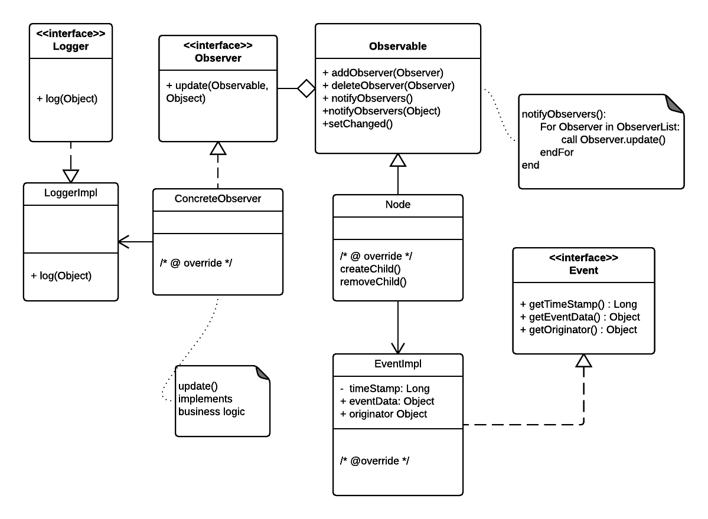

### Observer Pattern

#### A behavioral pattern

Define a one-to-many dependency between objects so that when one object changes state, all its dependents are notified and updated automatically. 

In this example we want to monitor child creation/removal event on a Node ( could be used to monitor a folder )

Source code stems from the following UML diagram:

